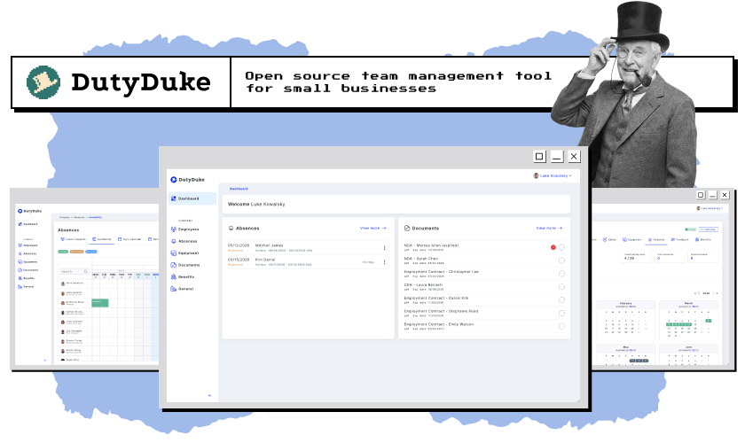
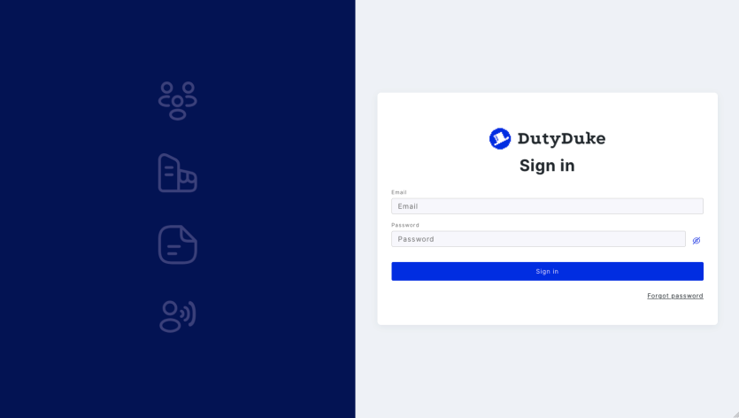
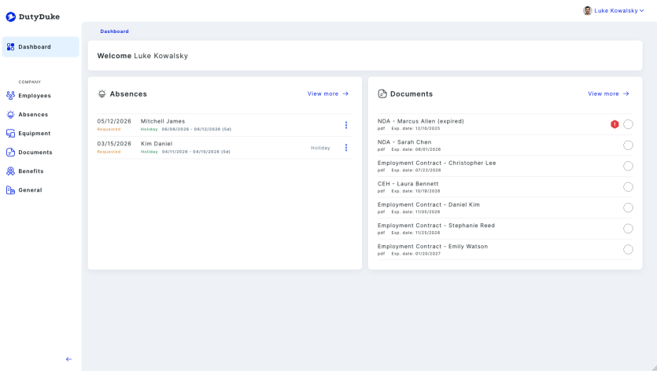
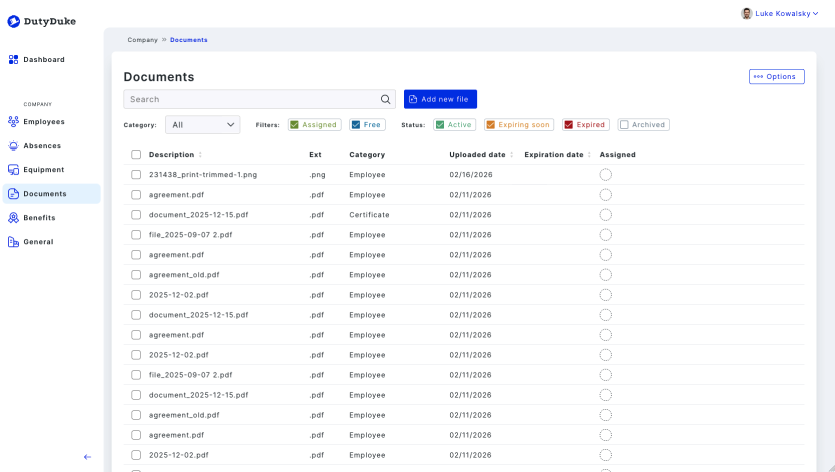
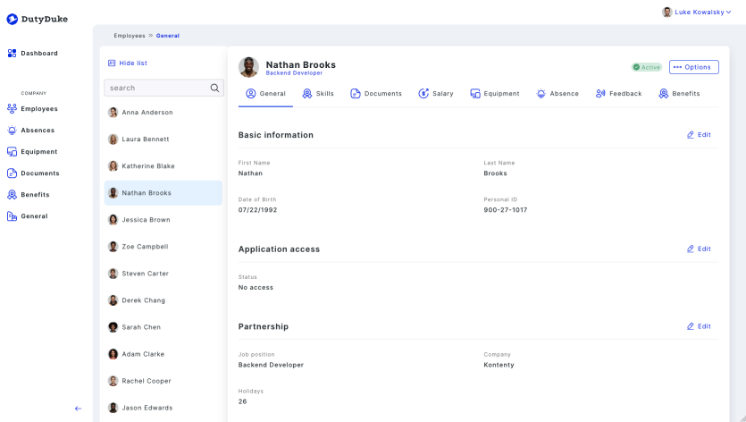
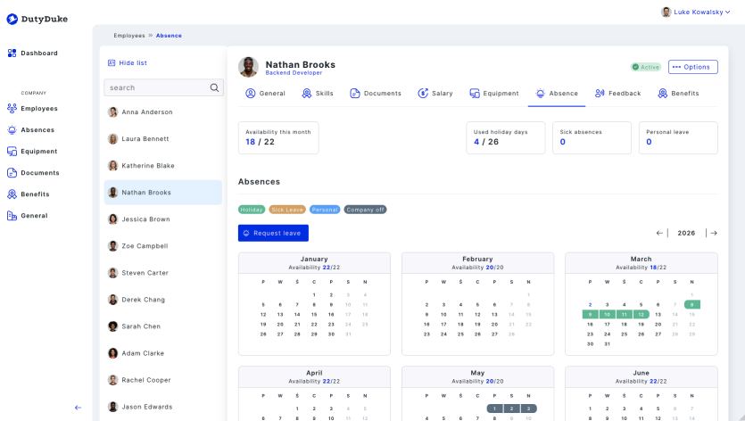
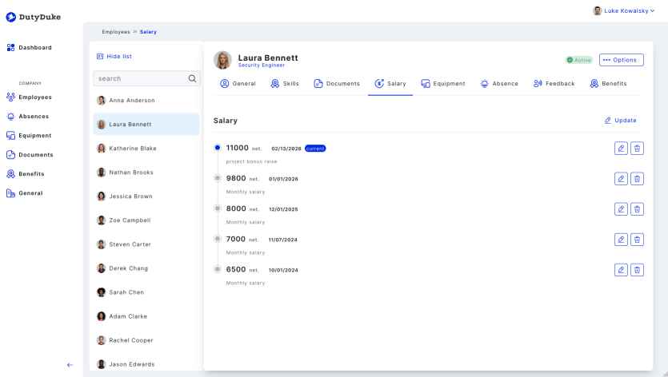
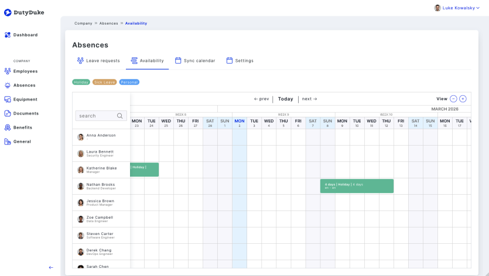
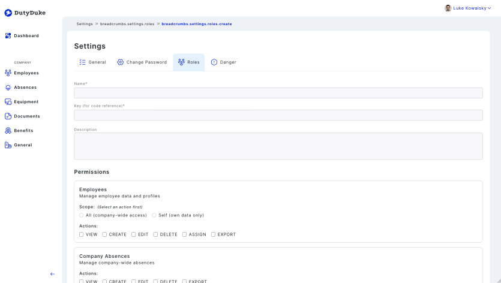

# Loopwork

[](LICENSE)

Open-source HRIS (Human Resource Information System) built with Next.js 15, TypeScript, Prisma, and PostgreSQL. Designed for small and mid-sized companies to manage employees, absences, documents, equipment, benefits, and more.

## What is Loopwork?

Loopwork is a self-hosted HR management platform following Clean Architecture principles. It provides a complete suite of HR tools — from employee onboarding and leave management to document tracking and performance feedback — all within a single deployable application.



## Features

- **Employee Management** — profiles, onboarding, employment history, skills, education
- **Absence Management** — leave requests, approval workflows, availability calendar, iCal export
- **Document Management** — upload, categorize, track expiration dates, assign to employees or company
- **Equipment Tracking** — inventory, assignments, changelog, status management
- **Benefits Administration** — create benefit plans, assign to employees
- **Performance Feedback** — schedule and track feedback sessions
- **Role-Based Access Control** — granular permissions per resource and action (VIEW, CREATE, EDIT, DELETE, ASSIGN, EXPORT)
- **CV Generation** — export employee profiles as PDF
- **Multi-language Support** — English and Polish out of the box (extensible via next-intl)
- **Field-Level Encryption** — sensitive data encrypted at the database level
- **Email Notifications** — account invitations, password resets (Mailcatcher for development)

### Screenshots

| | | | |
|:---:|:---:|:---:|:---:|
| [](docs/assets/screen_login.png) | [](docs/assets/screen_dashboard.png) | [](docs/assets/screen_docs.png) | [](docs/assets/screen_profile.png) |
| **Login** | **Dashboard** | **Documents** | **Employee Profile** |
| [](docs/assets/screen_absence.png) | [](docs/assets/screen_salary.png) | [](docs/assets/screen_availability.png) | [](docs/assets/screen_roles.png) |
| **Employee Absence** | **Salary** | **Availability** | **Roles** |

*Click any screenshot to view full size.*

## Quick Start

### Prerequisites

- Node.js (see `.nvmrc` for version)
- Yarn
- Docker & Docker Compose

### Setup

```bash
# 1. Clone and install
git clone https://github.com/Bitnoise/loopwork.git
cd loopwork
yarn install

# 2. Configure environment
cp .env.dist .env

# Edit .env and set required values:
#   PRISMA_FIELD_ENCRYPTION_KEY — generate at https://cloak.47ng.com/
#   JWT_SECRET — generate with: node -e "console.log(require('crypto').randomBytes(128).toString('hex'))"

# 3. Start database
docker-compose up -d

# 4. Setup database
yarn prisma:generate
yarn prisma:migrate
yarn prisma:seed

# 5. Create your admin account
yarn create:owner admin@example.com YourPassword123 John Doe

# 6. Create your organization
yarn organization:create MyOrganizationName

# 7. Start the app
yarn dev
```

Open [http://localhost:3000](http://localhost:3000) and sign in with your admin credentials.

## Tech Stack

| Layer | Technology |
|-------|-----------|
| Framework | Next.js 15 (App Router), React 18, TypeScript |
| Database | PostgreSQL 16 with PostGIS |
| ORM | Prisma 5 with field-level encryption |
| Auth | JWT with role-based access control |
| UI | Tailwind CSS, React Aria Components |
| Validation | Zod |
| Email | Nodemailer (Mailcatcher for dev) |
| Logging | Pino |
| Architecture | Clean Architecture, Repository Pattern, Use Case Pattern |
| Containerization | Docker, Docker Compose |

## Project Structure

```
loopwork/
├── src/
│   ├── api/hris/                    # Backend API (Clean Architecture)
│   │   ├── prisma/                  # Schema, migrations, seed
│   │   ├── authentication/          # Auth domain
│   │   ├── authorization/           # RBAC & permissions
│   │   ├── employees/               # Employee management
│   │   ├── company/                 # Company settings
│   │   ├── absences/                # Leave management
│   │   ├── benefits/                # Employee benefits
│   │   ├── documents/               # Document management
│   │   ├── feedback/                # Performance feedback
│   │   ├── resources/               # Skills, equipment, etc.
│   │   └── settings/                # Application settings
│   │
│   ├── app/                         # Next.js App Router
│   │   ├── (auth)/                  # Sign-in, password recovery
│   │   ├── (hris)/                  # Protected HR routes
│   │   └── api/                     # API routes
│   │
│   ├── lib/ui/                      # Reusable UI components
│   │
│   └── shared/                      # Constants, types, utils, services
│
├── messages/                        # i18n translations (en, pl)
├── docker-compose.yml               # PostgreSQL + Mailcatcher
├── Dockerfile                       # Production build
└── package.json
```

Each domain in `src/api/hris/` follows Clean Architecture:
- **Model** (`model/`) — DTOs, repository interfaces, use cases
- **Infrastructure** (`infrastructure/`) — Prisma repositories, controllers, ACLs, queries

## Scripts Reference

### Development

| Command | Description |
|---------|-------------|
| `yarn dev` | Start development server |
| `yarn build` | Build for production |
| `yarn start` | Start production server |
| `yarn lint` | Run ESLint + TypeScript check |
| `yarn fix` | Auto-fix lint issues |

### Database

| Command | Description |
|---------|-------------|
| `yarn prisma:generate` | Generate Prisma client |
| `yarn prisma:migrate` | Create and run migration |
| `yarn prisma:migrate:deploy` | Apply migrations (production) |
| `yarn prisma:reset` | Reset database (deletes all data) |
| `yarn prisma:studio` | Open Prisma Studio GUI |
| `yarn prisma:seed` | Seed default organization and roles |

### User Management

| Command | Description |
|---------|-------------|
| `yarn create:owner <email> <password> <firstName> <lastName>` | Create admin user with OWNER role |
| `yarn promote:owner <email>` | Promote existing user to OWNER |
| `yarn change:password <email> <newPassword>` | Reset a user's password |

### Demo Data

| Command | Description |
|---------|-------------|
| `yarn fixtures:load` | Load demo fixture data |
| `yarn fixtures:clean` | Remove and reload fixtures |

### Maintenance

| Command | Description |
|---------|-------------|
| `yarn nuke` | Clean install (removes .next, node_modules, reinstalls) |

## Environment Variables

See `.env.dist` for all options. Key variables:

| Variable | Required | Description |
|----------|----------|-------------|
| `DATABASE_URL` | Yes | PostgreSQL connection string |
| `PRISMA_FIELD_ENCRYPTION_KEY` | Yes | Encryption key ([generate here](https://cloak.47ng.com/)) |
| `JWT_SECRET` | Yes | Secret for JWT signing |
| `NEXT_PUBLIC_APP_URL` | Yes | Application URL (e.g., `http://localhost:3000`) |
| `ORGANIZATION_NAME` | No | Company name (default: "Loopwork") |
| `NEXT_PUBLIC_THEME` | No | UI theme: `hris` (default) or your own custom theme |
| `NEXT_PUBLIC_DEFAULT_LANGUAGE` | No | Default locale: `en` or `pl` |

## Local Services

When running with Docker Compose:

| Service | URL |
|---------|-----|
| Application | http://localhost:3000 |
| Mailcatcher UI | http://localhost:1080 |
| PostgreSQL | localhost:5432 |
| Prisma Studio | `yarn prisma:studio` |

## Documentation

- **[Getting Started](docs/getting-started/)** — [Installation](docs/getting-started/installation.md), [Configuration](docs/getting-started/configuration.md)
- **[Architecture](docs/architecture/)** — [Overview](docs/architecture/overview.md), [RBAC](docs/architecture/rbac.md)
- **[Guides](docs/guides/)** — [Deployment](docs/guides/deployment.md), [User Management](docs/guides/user-management.md)
- **[Development](docs/development/)** — [Project Structure](docs/development/project-structure.md), [Coding Standards](docs/development/coding-standards.md)

## Contributing

See [CONTRIBUTING.md](CONTRIBUTING.md) for development setup, code style, and pull request guidelines.

## License

MIT License - Copyright (c) 2024-2026 [Bitnoise](https://bitnoise.pl)

See [LICENSE](LICENSE) for details.
